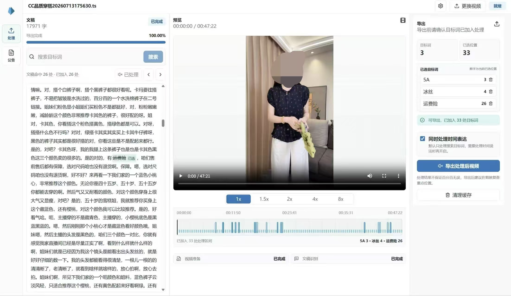
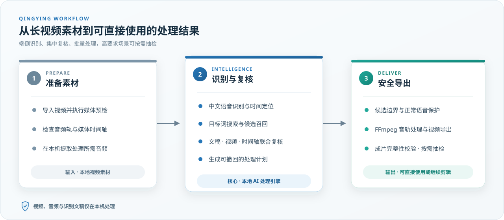
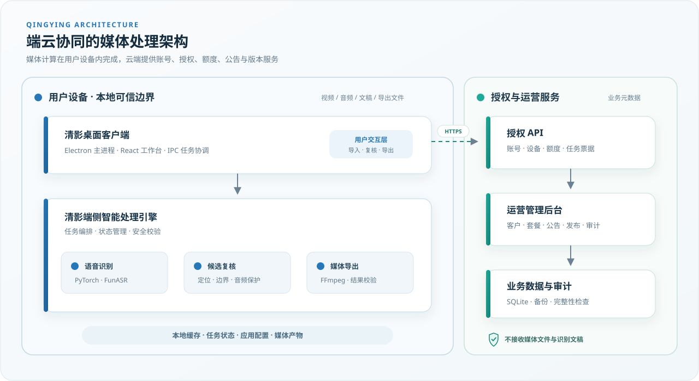

# 清影 Qingying — 中文长视频 AI 目标词批量处理系统

> 面向电商直播回放、长口播素材和批量二剪业务的 Windows 桌面软件。
> 将长视频文稿识别、目标词定位、人工复核、批量静音和视频导出整合为一套可安装、可授权、可运营的生产流程。

> [!IMPORTANT]
> **这是清影的公开 Demo 与技术说明仓库，不是完整源码仓库。** 仓库目前以 README 和公开展示素材为主，但页面中的产品界面、运行样例和系统能力均来自已经投入实际使用的软件，而非概念设计。真实产品由 Windows 桌面客户端、端侧智能处理引擎、授权服务和运营后台组成。
>
> 清影目前已有一家企业正在参与推广验证。为保护合作验证过程、核心处理链路和线上运营系统，完整源码现阶段暂不公开。
>
> **可以实际体验：** [下载 Windows 客户端（夸克网盘）](https://pan.quark.cn/s/5185b474a0ef?pwd=Ka6x#/list/share)，提取码 `Ka6x`。当前采用邀请制账号开通，下载后可通过 [718232157@qq.com](mailto:718232157@qq.com) 申请试用账号。

  

  <strong>公开 Demo 与技术说明</strong>&nbsp;&nbsp;·&nbsp;&nbsp;当前版本 1.0.37&nbsp;&nbsp;·&nbsp;&nbsp;Windows 10/11 x64&nbsp;&nbsp;·&nbsp;&nbsp;NVIDIA GPU&nbsp;&nbsp;·&nbsp;&nbsp;媒体端侧处理&nbsp;&nbsp;·&nbsp;&nbsp;已投入实际使用

## 项目概览

| 项目维度 | 说明 |
| --- | --- |
| 产品定位 | 位于剪映等专业剪辑软件之前的中文长视频口播目标词预处理系统 |
| 核心问题 | 数小时视频中，同一目标词可能出现数十至数百次，多词叠加后人工处理量可达数百乃至上千处 |
| 解决方案 | 本地语音识别、候选定位、文稿/视频/时间轴联动复核、正常语音保护、批量静音与安全导出 |
| 交付形态 | Windows 桌面客户端、端侧智能处理引擎、授权服务、运营后台和版本发布链路 |
| 项目状态 | 已投入真实使用，目前有一家企业正在参与推广验证 |

清影不是对模型接口的简单封装，也不是只展示界面的 Demo。项目从真实业务流程出发，把 AI 推理、音视频处理、人工确认、账号授权、运营管理和客户端交付组合成一套可以持续使用和迭代的软件系统。

## 典型应用场景

清影支持处理用户自行指定的任意目标词，不依赖固定敏感词库。用户输入需要处理的平台名称、营销用语、脏话、口误或其他指定词语后，系统会集中定位它们在长视频中的候选位置，经人工复核后批量处理对应音频区间。

| 应用场景 | 典型需求 |
| --- | --- |
| 跨平台录播素材适配 | 将某个平台产生的直播录播用于其他平台时，按新的发布要求处理原平台名称、平台专属功能词和直播引导语 |
| 直播录播转常规视频 | 处理“只限今晚”“马上下播”、活动日期、过期价格、优惠信息等只在直播当时成立的口播内容，使素材能够长期复用 |
| 多账号、多店铺和多客户版本 | 针对不同发布账号批量处理原账号名、主播名、店铺名、品牌名、优惠码、联系方式或合作方名称，减少重复剪辑 |
| 脏话、敏感词和指定风险词 | 根据团队审核后的目标词表，批量处理脏话、不文明用语、平台风险词、行业敏感词和品牌内部禁用词 |
| 口误、过期信息与隐私内容 | 定位并处理错误价格、产品型号、日期、人名、电话号码、客户名称、项目代号等已经确认需要移除的口播信息 |

主要使用者包括品牌自播团队、MCN 与直播代运营机构、批量二剪及后期外包团队，以及需要将同一份长视频适配到多个账号或渠道的内容运营团队。

> 清影负责执行用户明确指定的目标词定位与音频处理，不自动判断全部违规、敏感或隐私内容，也不替代平台规则判断、法律审核和最终人工复查。

## 业务价值

- **减少持续盯守**：将逐段搜索、反复试听和逐处处理转化为可独立执行的批量任务。任务运行期间，用户无需一直停留在剪辑软件前。
- **支持并行工作**：处理长视频的同时，可以继续完成选品、脚本整理、素材规划、内容发布和账号运营等工作。
- **扩大内容产能**：在相同人力投入下，团队能够处理更多长视频素材，并覆盖更多发布账号或客户版本。
- **降低重复劳动风险**：减少长时间人工操作及剪辑软件卡顿、重启和重新识别带来的时间损耗与返工。

清影提升的是目标词处理环节的效率和可控性，为扩大内容产能、运营更多账号和改善商业收益创造条件；实际收益仍取决于内容质量、选品、流量、平台运营和团队执行等因素。

## 项目成果

- 完成 Windows x64 安装包和独立端侧运行组件，可在用户设备内处理视频、音频和识别文稿。
- 建立从视频导入、文稿识别、目标词搜索、候选复核到批量导出的完整闭环。
- 实现桌面客户端、端侧智能处理引擎、线上授权服务和运营管理后台的协同。
- 建立账号、设备、额度、任务票据、公告、版本更新、风险事件和操作审计机制。
- 当前版本为 `1.0.37`，已进入真实业务使用及企业推广验证阶段。

### 真实运行样例

在 RTX 3060 实际处理样例中，一段约 1 小时的中文口播视频包含 8 类目标词、319 个待处理位置，从识别结果进入批量处理到完成导出约需 10 分钟；导出结果经剪映文稿复查，该样例未发现目标词遗漏。

若由人工逐处查找并剪辑这 319 个目标词位置，根据操作者熟练度不同，预计需要约 30–80 分钟。与清影约 10 分钟的批量处理耗时相比，该样例单次可节省约 20–70 分钟，处理耗时缩短约 **67%–88%**，相当于约 **3–8 倍**的处理速度。

上述人工耗时按剪辑流程连续、软件响应正常的情况估算。在实际长视频工程中，人工效率还会受到剪辑软件、设备性能和工程复杂度影响。以剪映等软件处理部分长视频工程的实际情况为例，随着使用时间和操作量增加，可能出现预览、文稿或时间轴响应变慢；若需要重启软件、重新加载工程或重新识别文稿，处理时间会进一步延长，极端情况下的软件卡死或崩溃还可能造成未保存进度丢失和重复劳动。

清影将目标词检索、位置复核和批量音频处理前置为独立任务，并提供任务进度与缓存管理；处理完成后再将结果导入专业剪辑软件进行最终复查。这不仅减少逐处人工操作，也降低了长时间停留在大型剪辑工程中所带来的性能波动和返工风险。上述 **3–8 倍**仅按理想人工耗时计算，未将软件卡顿、重新识别或进度丢失造成的额外时间计入。

> 以上为单次真实软件样例与人工经验估算，不构成通用性能、效率或准确率承诺。实际耗时和结果会受到操作者熟练度、剪辑软件状态、设备性能、显卡、素材编码、语速、背景噪声、目标词数量与模型状态影响，最终成片仍需人工复查。

## 工程实现

### 产品流程与系统设计

- 将人工搜索文稿、定位时间点、试听上下文和逐处静音的操作抽象为标准化软件流程。
- 设计“AI 提供候选、用户确认处理计划、系统安全执行”的人机协作方式，避免完全自动处理带来的不可控风险。
- 划分桌面客户端、端侧智能处理引擎和远端授权运营服务的职责边界。

### 桌面端与交互

- 使用 Electron、React 和 TypeScript 实现 Windows 桌面客户端。
- 将可搜索文稿、视频预览、倍速播放、候选跳转、命中时间轴和导出计划整合到同一工作台。
- 通过 Electron IPC 协调界面、文件系统、端侧任务和授权状态。

### AI 与音视频处理

- 基于 Python、PyTorch、FunASR 和 ModelScope 构建中文长音频识别与时间定位链路。
- 处理目标词精确匹配、同音候选、字符级时间边界以及多次命中聚合。
- 使用 FFmpeg 完成音频抽取、目标区间处理、音轨替换和导出结果校验。
- 引入多阶段候选复核、边界检查和正常语音保护，降低批量处理对非目标内容的影响。

### 后台、授权与交付

- 实现账号、设备绑定、有效期、使用额度、重置次数和短时任务票据管理。
- 建设客户、套餐、合作方、订单、公告、协议、版本发布、风险事件和操作记录等运营能力。
- 完成 Windows 安装包、运行组件管理、版本检查、最低版本控制、安装包哈希校验和升级引导。
- 补充后台多因素认证、登录限制、关键操作审计、备份和服务健康检查。

## 核心技术难点

这个项目真正困难的部分并不是“识别出一个词”，而是把不稳定的识别结果转换成可以安全执行的音频区间。长视频、密集口播和极短词边界会同时放大时间误差，因此处理链路采用“多路召回、局部对齐、候选共识、导出前后复核”的方式逐步收敛结果。

| 技术难点 | 处理思路 |
| --- | --- |
| 长视频识别时间戳漂移 | 先将音频规范到连续时间基准，再围绕候选构造多组偏移窗口进行局部强制对齐；对多个窗口返回的字符级边界做稳定性筛选和中位数收敛，并通过导出前后的二次复核继续修正漂移区间 |
| 同一目标词在短时间内高频出现 | 将相邻候选放入同一上下文簇重新识别，对候选与实际出现位置执行一对一分配，避免多个候选重复占用同一次命中；同时补回簇内未分配但具备完整证据的出现位置，并检查处理后是否仍有目标词残留 |
| 多个目标词不间断连续出现 | 在同一局部上下文中联合对齐全部目标词，按词元时间范围保留独立处理区间；结合目标词顺序和上下文证据修复连续序列中的缺失项，并检查新区间是否侵入相邻词或正常语音 |
| 单字目标词边界极短 | 单字词只接受精确锚点，且在短词被更长目标词覆盖时优先保留长词；通过多窗口共识、单字专用最小时长和非对称边界补偿稳定处理范围，二次修正只有在不增加相邻词与非目标词重叠时才会被采用 |
| ASR 替换、漏字与同音误识别 | 组合精确匹配、拼音候选、上下文变体和局部强制对齐提升召回；低置信候选必须获得跨窗口或上下文证据，不能仅凭一次模糊命中直接进入处理计划 |
| 批量处理容易误伤正常语音 | 在处理前后执行目标覆盖、非目标词重叠和正常音频保护检查；高风险区间无法通过安全复核时停止自动导出，保留人工确认入口 |
| AI 任务耗时长且资源占用高 | 将模型和媒体任务从 UI 进程中分离，提供任务状态、进度反馈、异常重试和缓存管理 |
| 桌面端 AI 环境交付复杂 | 将客户端与端侧运行组件分开管理，统一模型依赖、媒体工具、版本兼容和安装更新流程 |
| 软件进入真实使用后需要运营控制 | 建立账号、设备、额度、任务授权、公告、版本发布和审计体系，而非仅交付离线脚本 |

## 核心工作流

1. **导入视频**：检查视频、音频轨和时间轴，准备端侧处理任务。
2. **识别文稿**：在用户设备内完成长音频识别，生成带时间信息的中文文稿。
3. **搜索目标词**：检索目标词及候选命中，集中查看它们在全文中的位置。
4. **可视化复核**：通过文稿高亮、视频预览、倍速播放和时间轴确认上下文。
5. **生成处理计划**：将确认后的候选位置加入计划；按需开启时间表达式处理。
6. **安全处理与导出**：批量处理目标词对应音频区间，保护正常语音，并输出可复查的视频。
7. **剪辑软件复查**：将结果导入剪映等工具，对重点位置进行最终人工确认。

  

## 系统架构

清影采用端云协同架构。视频、音频、识别文稿与导出文件只进入用户设备内的处理链路；云端服务负责账号、设备、额度、任务授权、公告和版本更新，不接收用户的视频、音频或识别文稿。

  

### 架构设计要点

- **端侧处理**：核心媒体数据保留在用户设备内，兼顾隐私、带宽成本和长视频处理效率。
- **职责分离**：React 工作台负责交互，Electron 主进程负责系统能力协调，端侧引擎负责 AI 与媒体任务。
- **远端轻量化**：云端只处理授权运营所需的业务元数据，不承担用户媒体文件的上传与计算。
- **可运营交付**：产品具备客户端更新、额度控制、公告触达、安全审计和后台管理能力。

## 产品能力

- **中文长视频识别**：生成可检索、带时间信息的长口播文稿。
- **目标词批量定位**：汇总同一目标词的多处候选，减少逐段查找和试听。
- **三位一体复核**：联动文稿高亮、视频预览和命中时间轴。
- **可控处理计划**：目标词按组管理，可查看已选位置并随时撤回。
- **时间表达式处理**：可选处理具体时间、早中晚和特定节日等时间说法。
- **正常音频保护**：通过多阶段复核和边界检查降低误处理风险。
- **持续交付能力**：支持授权、额度、任务进度、缓存清理、公告和客户端更新。

## 技术栈

| 领域 | 技术与实践 |
| --- | --- |
| 桌面客户端 | Electron 37、React 19、TypeScript、Vite / electron-vite、IPC |
| AI 与语音 | Python 3.11、PyTorch、TorchAudio、FunASR、ModelScope、pypinyin |
| 音视频处理 | FFmpeg：音频提取、区间处理、音轨替换和导出校验 |
| 端侧引擎 | 任务编排、状态管理、进度反馈、异常恢复和缓存管理 |
| 授权与运营 | 账号、设备、额度、任务票据、公告、版本发布和审计记录 |
| 数据与服务 | SQLite、HTTP API、备份、健康检查与安全策略 |
| 工程化发布 | Electron Builder、NSIS、Windows x64 安装包、核心资产校验 |

## 下载与邀请制试用

**[下载清影（夸克网盘）](https://pan.quark.cn/s/5185b474a0ef?pwd=Ka6x#/list/share)** · 提取码：`Ka6x`

清影目前处于小规模市场验证阶段。为确保试用场景与当前版本匹配，并做好设备配置、使用额度和上手支持，现阶段由运营人员审核后在后台统一开通账号，暂不开放自助注册。

账号和初始密码由运营人员通过约定渠道单独交付。当前版本暂不支持首次登录自行设置密码或自助找回密码；如忘记密码，需要核验账号信息后由运营人员人工重置。

如需申请试用，请发送邮件至 **[718232157@qq.com](mailto:718232157@qq.com)**，邮件主题建议填写“清影试用申请”，并简单说明使用场景、常见视频时长和电脑显卡型号。请勿发送真实业务视频或其他敏感素材。

目前用户规模和下载量仍然有限，为使基础设施投入与市场验证阶段相匹配，安装包暂通过夸克网盘分发，尚未部署独立 CDN。后续将根据实际下载需求评估对象存储、CDN 加速和自动更新分发方案。

## 运行要求与能力边界

- 支持 Windows 10/11 64 位。
- NVIDIA GPU 为必需配置，推荐 6 GB 以上显存。
- 清影专注于口播文稿识别、目标词搜索、音频预处理和视频导出，不替代专业剪辑软件。
- 当前不提供人声分离、违规画面识别、马赛克、删除片段或逐帧修复。
- ASR 和字符级时间戳会受到语速、口音、噪声及背景音乐影响。
- 处理结果不承诺百分之百无遗漏或无误伤，导出后应在专业剪辑软件中复查。

## 仓库与源码说明

本仓库是清影的**公开产品与技术展示仓库**，用于介绍产品定位、系统架构、工程方案、真实运行样例和试用方式，不包含完整产品源码，也不构成开源授权。

清影目前已有一家企业正在参与推广验证。考虑到产品仍处于市场验证阶段，同时需要保护合作验证过程、核心处理链路和线上授权运营系统的安全，完整客户端、端侧智能处理链路、授权服务及运营后台源码现阶段暂不公开。后续将根据验证结果、产品成熟度和商业合作边界，再评估可公开的技术范围。

清影客户端、界面设计、业务逻辑和处理流程保留全部权利。未经书面授权，不得复制、分发、转售、逆向、破解或绕过授权机制。

本项目由作者负责产品设计、系统架构及核心工程实现。

如需沟通项目技术、产品试用或推广验证，请联系 **[718232157@qq.com](mailto:718232157@qq.com)**。
